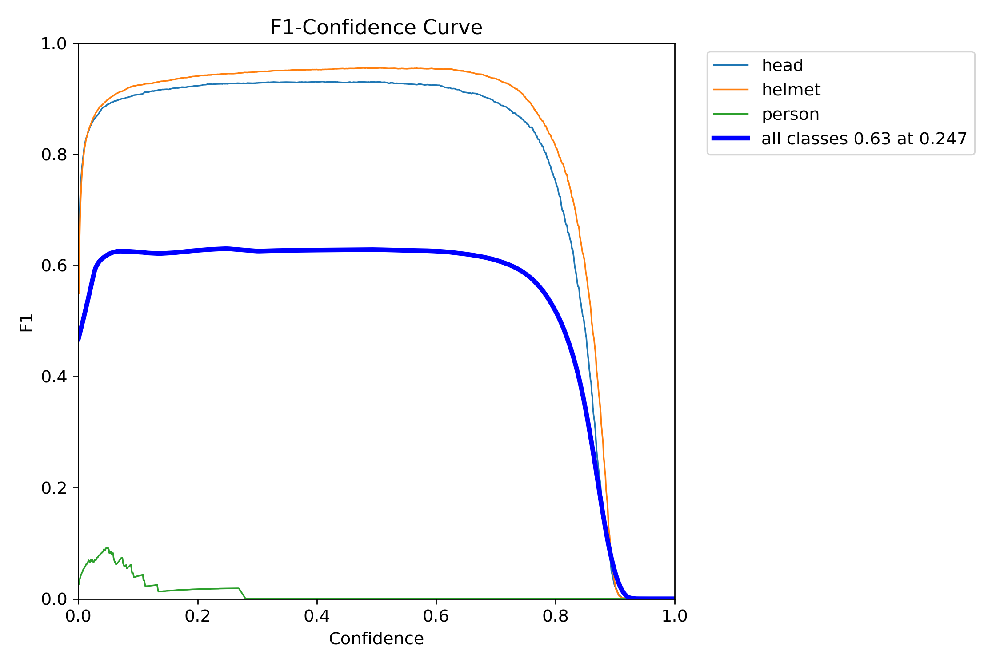
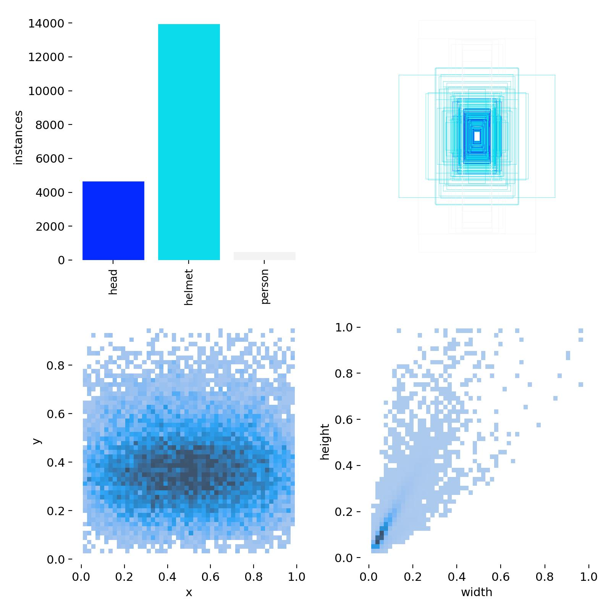
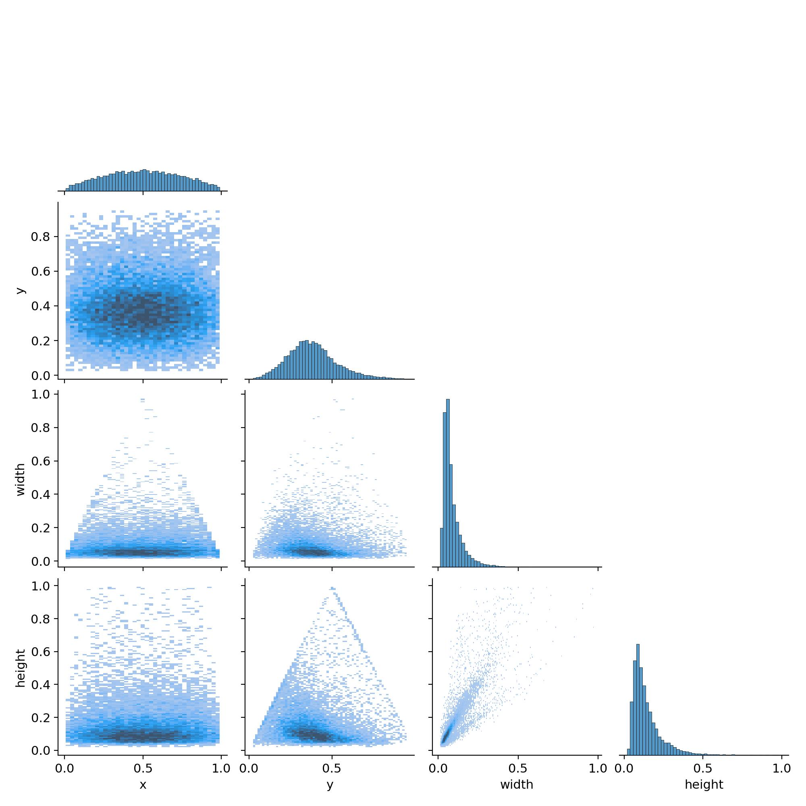

# Hard Hat Worker Detection with YOLOv8

## Description

A YOLOv8 hard-hat worker detection notebook using a Roboflow dataset, model training, and inference on test images.

## Key Features

- Roboflow hard-hat dataset download
- YOLOv8s training workflow
- Inference on test images
- Label and F1 curve visualizations
- Workplace-safety computer vision experiment

## Tech Stack

- Python
- Jupyter Notebook
- Roboflow
- Ultralytics YOLOv8
- OpenCV
- PyTorch

## Installation

pip install roboflow ultralytics opencv-python matplotlib

## Usage

Open `hard_workers_detection1.ipynb`, configure Roboflow securely, train YOLOv8, then run inference on test images.

## Screenshots

## License

No license file is currently included. Add a license before reusing, distributing, or publishing this project for public collaboration.

